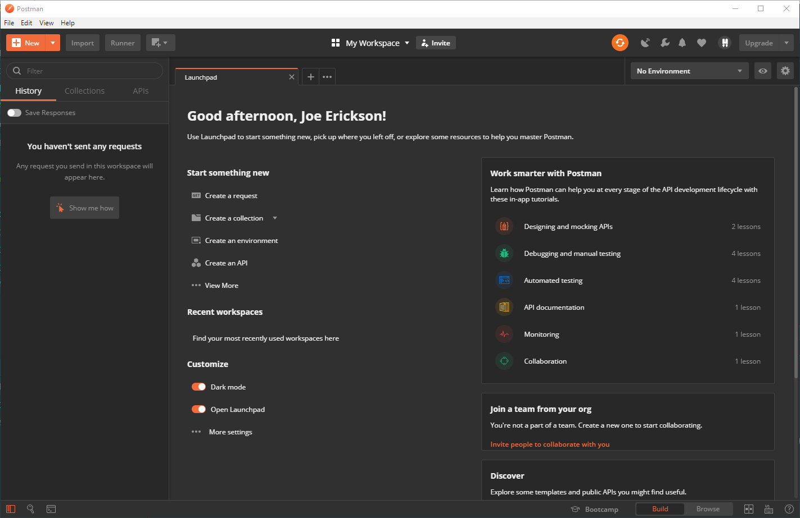
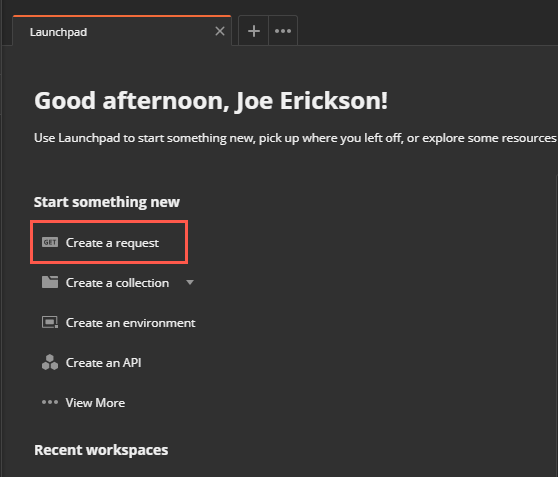
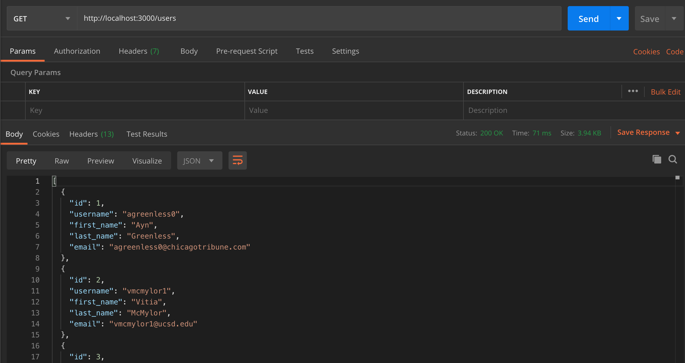
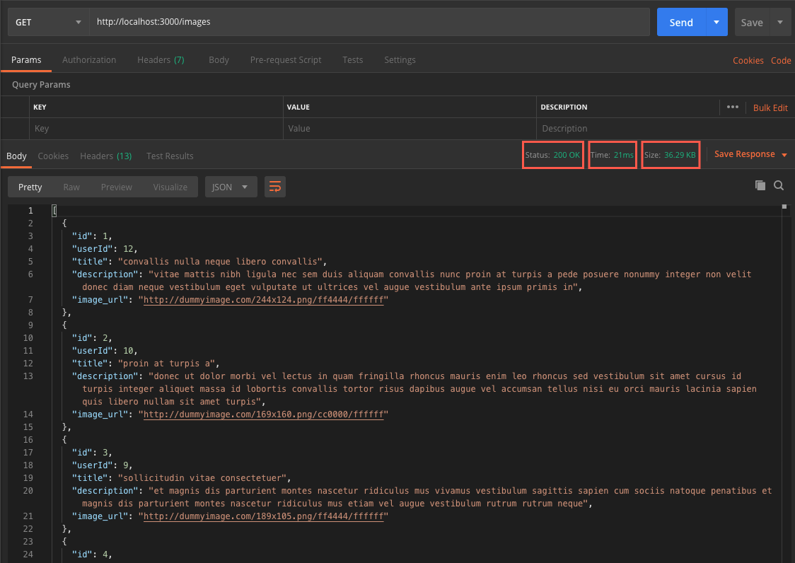
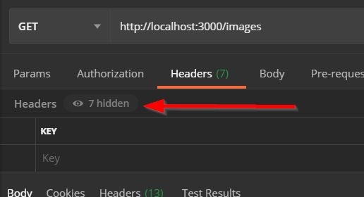
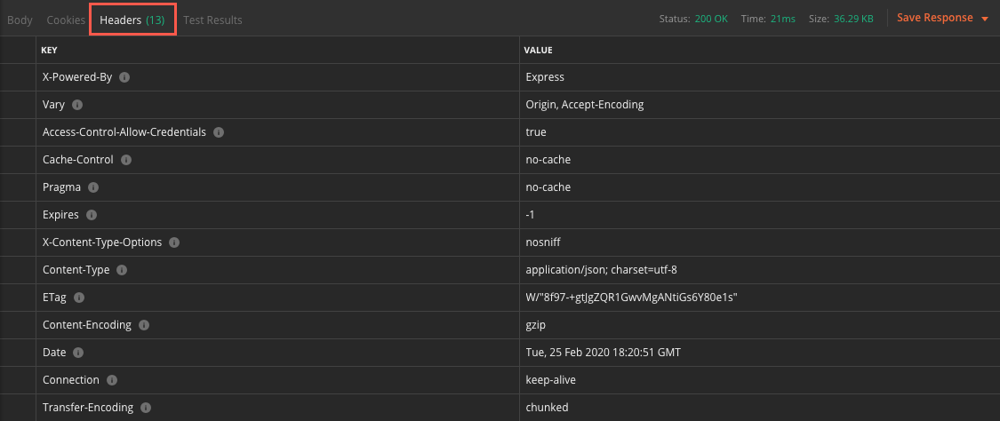

# Tutorial for Postman

In this tutorial, you'll learn how to call a web API using Postman.

## Step One: Start the API server

1. Open termainal and make sure you are in the postman-tutorial directory.  Do an 'ls' coomand to list directory contents and verify that you see a package.json file. If so, you are in the right place. 

2. Run the command `npm install` to build the project.

3. Start the project by running `npm run serve`. This starts a local web API server that you'll use with Postman. The server is an API that simulates an Instagram-like API with users, images, and comments.

Once the server starts, you'll see a message that looks like this:

```
  \{^_^}/ hi!

  Loading ./db/instaounce.json
  Done

  Resources
  http://localhost:3000/users
  http://localhost:3000/images
  http://localhost:3000/comments

  Home
  http://localhost:3000

  Type s + enter at any time to create a snapshot of the database
```

If you see this message, it means that the web API server has started successfully and is now waiting for requests. To send it HTTP requests, you'll use Postman.

## Step Two: Start Postman

Postman should be installed on your laptop already. The icon looks like this in either your start menu or in your Applications folder:


Double-click that icon. You should see a new screen like this:



Postman is an application that lets you make HTTP requests like a browser but instead shows the raw information returned from the server. When you're interacting with a web server, that information is typically HTML. But when interacting with a web API, that information is usually JSON data, and a browser isn't designed to display that information very well.

Web APIs also typically expect special HTTP headers and status codes that are more complex to set in a browser, so Postman is used in those circumstances. Think of it as your first interface to a Web API.

## Step Three: Create a new request in Postman

In the Postman interface, click the "Create a request" link to start a new API session:



This session records and lets you play back API requests.

For your first request, make a request that returns all the users as an array. The URL for that request is `http://localhost:3000/users`. Enter the URL in the text box and then click send:


In the body tab, you'll see the JSON data for 25 users:



### 1. Modify GET request

If you change the request to `http://localhost:3000/images`, you'll see the image information load in when you click Send. 

The Postman interface also shows you three important pieces of information about the request: the returned HTTP Status Code, how long the response took, and the size of the response data:



You can use this information for debugging purposes—for example, how slow the API response is in case you need to compensate for it.

## Step Four: Review request and response headers

Clicking on Headers in the Request section lets you set HTTP headers for the request and see what HTTP headers Postman sets for the request:


Postman sets and auto-generates some of the headers, like the User-Agent and Host. These can be overwritten by your own headers for testing or exercising the back-end API.

>Note: You may need to click the "X hidden" button to show the hidden headers.



You can also see the Response Headers that the server sends back in the Response view:



These are the headers that the server sends back. These can be useful to look at if you need to debug the API.

## Summary

You can now:

- Open Postman
- Make requests in Postman to web APIs
- View and set the HTTP Headers in the request
- View the Response Status Code, response time, size, and headers